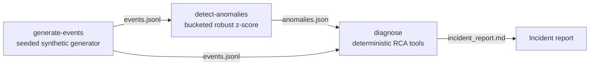

# OpsFlow AI — Autonomous Operational Data Platform

A synthetic operational data platform for high-volume event systems such as logistics,
airport systems, manufacturing, fintech operations, telecom, cloud operations, or other
mission-critical environments.

**Pipeline:** synthetic operational events → statistical anomaly detection →
deterministic root-cause analysis → Markdown incident report.

The flagship demo domain is airport/logistics-style operational telemetry (baggage
scans, OCR reads, routing decisions), but the event model, detection, and RCA layers
are domain-generic and config-driven.

## Why this exists

Operational platforms live or die on questions like: *Is this failure spike real?
Where is it localized? What changed vs baseline? What should the on-call engineer do
first?* This project demonstrates that full loop as working code, with production-style
concerns built in:

- **Event-time correctness** — all metrics computed on event timestamps, so backfills
  and re-runs never create false spikes
- **Config-driven design** — anomaly scenarios are data, not code; adding one doesn't
  touch the generator or detector
- **Evidence-based RCA** — the diagnosis workflow computes concentration, deltas, and
  correlations from the data and cites every number; it never invents explanations
- **Deterministic and testable** — seeded generation, robust statistics, full pytest
  coverage of the pipeline

## No real data

This is a **clean-room, synthetic-only** project. Every event is generated by
`opsflow generate-events`. There are no real company names, systems, hostnames, paths,
logs, or credentials anywhere in this repository, and there never will be.

## Quickstart

```bash
python3 -m venv .venv
source .venv/bin/activate
pip install -e ".[dev]"
```

### P0 demo — the full incident loop

```bash
python -m opsflow generate-events --count 1000 --scenario ocr_failure_spike --output sample_data/events.jsonl
python -m opsflow detect-anomalies --input sample_data/events.jsonl --output sample_data/anomalies.json
python -m opsflow diagnose --input sample_data/anomalies.json --events sample_data/events.jsonl --output reports/incident_report.md
```

This generates 2 hours of synthetic telemetry with a localized OCR failure spike
injected on one gate, detects the anomaly window with robust statistics
(median/MAD z-score over time buckets), and writes an incident report with timeline,
baseline-vs-anomaly comparison, blast radius, evidence trace, a rule-based root-cause
hypothesis with a confidence level, and recommended actions.

```bash
pytest        # run the test suite
```

### Example RCA output

Excerpt from [reports/sample_incident_report.md](reports/sample_incident_report.md)
(full curated example committed in this repo):

> Between **2026-07-03T02:35:00+00:00** and **2026-07-03T03:05:00+00:00**, the failure
> rate rose to **47.7%** against a baseline of **2.7%** (123 failures across 258
> events). Failures concentrated on **OCR_GATE_02** at **LOC_A02**.
>
> **Root-cause hypothesis** — Localized read-quality degradation on OCR_GATE_02 at
> LOC_A02: confidence collapsed while retries and failures spiked on this component
> only (dominant error: ERR_OCR_LOW_CONFIDENCE). […]
> **Confidence level:** high (evidence score 7/7)

Every number in the report is computed from the event data, and the report includes
the full diagnostic trace of tool invocations that produced it.

### P1 demo — Postgres ingestion + dbt models

Requires Docker. Install the extras first: `pip install -e ".[postgres,dbt]"`

```bash
docker compose up -d                                      # local Postgres 16
python -m opsflow generate-events --count 1000 --scenario ocr_failure_spike --output sample_data/events.jsonl
python -m opsflow ingest --input sample_data/events.jsonl # idempotent load
python -m opsflow ingest --input sample_data/events.jsonl # re-run: 0 inserted, 1000 skipped

cd dbt
cp profiles.yml.example profiles.yml                      # synthetic local-dev values
dbt run --profiles-dir .                                  # staging views + marts
dbt test --profiles-dir .                                 # schema tests
cd ..
```

Ingestion validates every row through the same Pydantic schema as P0 and inserts
with `ON CONFLICT (event_id) DO NOTHING`, so re-runs and backfills never
double-count. The dbt layer builds `stg_events` / `stg_ocr_events` /
`stg_alarm_events` staging views and `event_summary` / `ocr_health` /
`component_health` marts in the `analytics` schema — `ocr_health` uses the same
5-minute event-time buckets as the Python detector.

## Architecture overview



- `src/opsflow/data_gen/` — Pydantic event schema, scenario configs, seeded generator
- `src/opsflow/detection/` — event-time bucketing, window metrics, anomaly detector
- `src/opsflow/rca/` — tool-style evidence functions, diagnosis workflow, report writer
- `src/opsflow/ingestion/`, `src/opsflow/db/` — idempotent Postgres loader + schema
- `dbt/` — staging views and health marts over `raw_events`, with schema tests

Full details: [docs/architecture.md](docs/architecture.md)

## About the RCA "agent"

The RCA layer is a **deterministic, tool-style diagnostic workflow** — a fixed
pipeline of evidence-gathering functions with a rule-based hypothesis engine. It is
intentionally not an LLM: every claim in the report traces back to a computed number,
and the tool-invocation trace is included in the report for transparency.

## Tech stack

- **Python 3.10+** — Pydantic v2 (event schema/validation), Click (CLI)
- **PostgreSQL 16** (via docker-compose) — raw event store, `psycopg` v3 loader
- **dbt** (dbt-core 1.10/1.11 + dbt-postgres) — staging views, health marts, schema tests
- **pytest** — 21 tests covering generation, detection, RCA, CLI, and ingestion units

Design decisions are recorded as ADRs in [docs/adr/](docs/adr/).

## Project status & roadmap

- **P0 (done):** file-based flow — generate → detect → diagnose, tested
- **P1 (done):** idempotent Postgres ingestion + dbt staging/marts + 17 dbt tests
- **P2 (done):** docs, ADRs, dependency stabilization, portfolio polish
- **P3 (stretch, not started):** GitHub Actions CI, Grafana dashboard, more anomaly
  scenarios (routing storm, controller flap)

## Limitations

- Data is synthetic by design; scenarios approximate real failure modes but are
  simplifications (see [ASSUMPTIONS.md](ASSUMPTIONS.md)).
- The RCA engine maps evidence to known failure-mode templates; it cannot discover
  novel causes.
- Detection operates on 5-minute buckets: sub-bucket spikes or slow gradual
  degradations may be missed, and the baseline comes from the non-anomalous part of
  the same stream.
- Database-dependent behavior (insert/idempotency against live Postgres) is verified
  with documented manual commands, not in pytest, to keep the suite Docker-free.
- Single-node, batch-oriented: no streaming, no scheduler, no dashboarding — by
  scope choice, not oversight.
