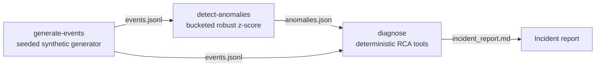

# OpsFlow AI — Autonomous Operational Data Platform

A synthetic operational data platform for high-volume event systems such as logistics,
airport systems, manufacturing, fintech operations, telecom, cloud operations, or other
mission-critical environments.

**Pipeline:** synthetic operational events → statistical anomaly detection →
deterministic root-cause analysis → Markdown incident report.

The flagship demo domain is airport/logistics-style operational telemetry (baggage
scans, OCR reads, routing decisions), but the event model, detection, and RCA layers
are domain-generic and config-driven.

## Why this exists

Operational platforms live or die on questions like: *Is this failure spike real?
Where is it localized? What changed vs baseline? What should the on-call engineer do
first?* This project demonstrates that full loop as working code, with production-style
concerns built in:

- **Event-time correctness** — all metrics computed on event timestamps, so backfills
  and re-runs never create false spikes
- **Config-driven design** — anomaly scenarios are data, not code; adding one doesn't
  touch the generator or detector
- **Evidence-based RCA** — the diagnosis workflow computes concentration, deltas, and
  correlations from the data and cites every number; it never invents explanations
- **Deterministic and testable** — seeded generation, robust statistics, full pytest
  coverage of the pipeline

## No real data

This is a **clean-room, synthetic-only** project. Every event is generated by
`opsflow generate-events`. There are no real company names, systems, hostnames, paths,
logs, or credentials anywhere in this repository, and there never will be.

## Quickstart

```bash
python3 -m venv .venv
source .venv/bin/activate
pip install -e ".[dev]"
```

### P0 demo — the full incident loop

```bash
python -m opsflow generate-events --count 1000 --scenario ocr_failure_spike --output sample_data/events.jsonl
python -m opsflow detect-anomalies --input sample_data/events.jsonl --output sample_data/anomalies.json
python -m opsflow diagnose --input sample_data/anomalies.json --events sample_data/events.jsonl --output reports/incident_report.md
```

This generates 2 hours of synthetic telemetry with a localized OCR failure spike
injected on one gate, detects the anomaly window with robust statistics
(median/MAD z-score over time buckets), and writes an incident report with timeline,
baseline-vs-anomaly comparison, blast radius, evidence trace, a rule-based root-cause
hypothesis with a confidence level, and recommended actions.

See [reports/sample_incident_report.md](reports/sample_incident_report.md) for example
output.

```bash
pytest        # run the test suite
```

## Architecture overview



- `src/opsflow/data_gen/` — Pydantic event schema, scenario configs, seeded generator
- `src/opsflow/detection/` — event-time bucketing, window metrics, anomaly detector
- `src/opsflow/rca/` — tool-style evidence functions, diagnosis workflow, report writer
- `src/opsflow/ingestion/`, `src/opsflow/db/`, `dbt/` — P1 Postgres/dbt layer (planned)

Full details: [docs/architecture.md](docs/architecture.md)

## About the RCA "agent"

The RCA layer is a **deterministic, tool-style diagnostic workflow** — a fixed
pipeline of evidence-gathering functions with a rule-based hypothesis engine. It is
intentionally not an LLM: every claim in the report traces back to a computed number,
and the tool-invocation trace is included in the report for transparency.

## Roadmap

- **P0 (done):** file-based flow — generate → detect → diagnose, tested
- **P1:** Postgres ingestion (idempotent, watermark-based) + dbt staging/marts + dbt tests
- **P2:** docs polish, coverage, packaging
- **P3 (stretch):** GitHub Actions CI, Grafana dashboard, more anomaly scenarios
