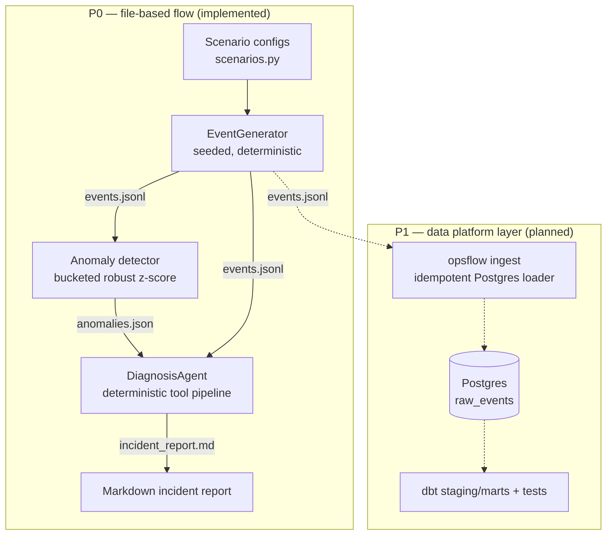

# OpsFlow AI — Architecture

## Overview

OpsFlow AI is a synthetic operational data platform that demonstrates the full
incident loop for high-volume event systems: telemetry generation, statistical
anomaly detection, and evidence-based root-cause analysis. The demo domain is
airport/logistics-style operational telemetry, but every layer is domain-generic
and config-driven.



## P0 flow

1. **generate-events** (`data_gen/`): a single seeded `random.Random` produces a
   sorted stream of Pydantic-validated events over a configurable timespan. A
   scenario config (not code) defines an anomaly window and how events inside it
   degrade. Ground truth is recorded in `metadata.injected_anomaly` for testing only.
2. **detect-anomalies** (`detection/`): events are bucketed on **event time**
   (5-minute buckets by default). Per-bucket failure rates are scored with a robust
   z-score (median/MAD, so the anomaly can't inflate its own baseline), guarded by an
   absolute failure-rate floor, a minimum delta vs median, and a minimum bucket size.
   Consecutive flagged buckets merge into anomaly windows; non-flagged buckets form
   the baseline. Output includes window metrics, baseline metrics, and failure
   concentration by component/location/error code.
3. **diagnose** (`rca/`): for each anomaly window, `DiagnosisAgent` runs a fixed
   pipeline of tool functions and writes a Markdown report.

## RCA design

The RCA layer is a **deterministic, tool-style diagnostic workflow** — not an LLM.
Tools are pure functions over the event data:

`load_events`, `filter_events_by_window`, `compare_baseline_vs_anomaly`,
`find_component_concentration`, `find_location_concentration`,
`find_error_code_concentration`, `correlate_retry_count_and_confidence`,
`build_timeline`, `estimate_blast_radius`, `generate_hypothesis`,
`generate_recommended_actions`.

Every tool invocation is logged and printed in the report ("diagnostic trace").
`generate_hypothesis` scores the evidence (component concentration, confidence drop,
retry rise, retry↔confidence anti-correlation, error-code dominance) into a 0–7
score mapped to low/medium/high confidence, and selects a failure-mode template that
cites only computed numbers. If evidence does not localize the fault, the hypothesis
says so and the recommended actions widen to shared upstream dependencies.

This mirrors how a good on-call engineer works: gather evidence, compare against
baseline, localize, then hypothesize — never the other way around.

## P1 flow (planned)

```
docker compose up -d
python -m opsflow ingest --input sample_data/events.jsonl
cd dbt && dbt run && dbt test
```

- **Ingestion**: idempotent batch loading into `raw_events`
  (`ON CONFLICT (event_id) DO NOTHING`), watermark/state-based incremental extraction
  on event time so re-runs and backfills never double-count or create false spikes.
- **dbt**: staging views over `raw_events`, marts for failure rates by
  component/window, dbt tests (not null, accepted values, uniqueness).
- **Retention**: optional rolling-window retention config (aging out old partitions).

## Security & privacy

Clean-room, synthetic-only project. All data is generated in-repo; there are no real
company names, hostnames, IPs, paths, table names, logs, or credentials anywhere.
Local Postgres credentials in `.env.example`/`docker-compose.yml` are throwaway dev
values for a container on localhost. See CLAUDE.md for the binding rules.

## Future roadmap

- P1: Postgres ingestion + dbt models/tests
- P2: coverage, packaging polish, ADRs for key decisions
- P3 (stretch): GitHub Actions CI, Grafana dashboard on Postgres, additional
  scenarios (e.g. routing storm, controller flap), more marts
